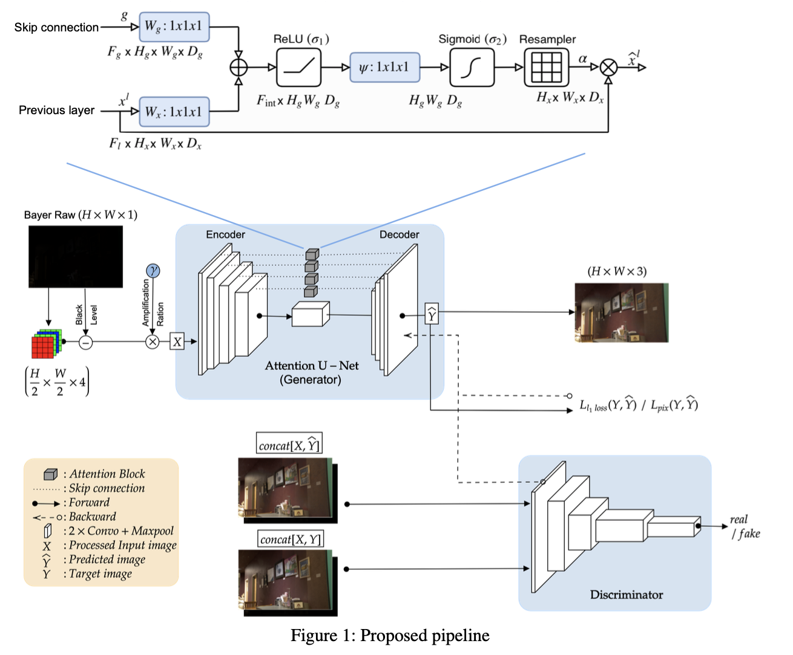
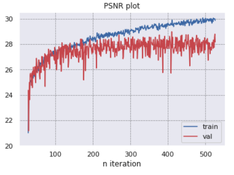
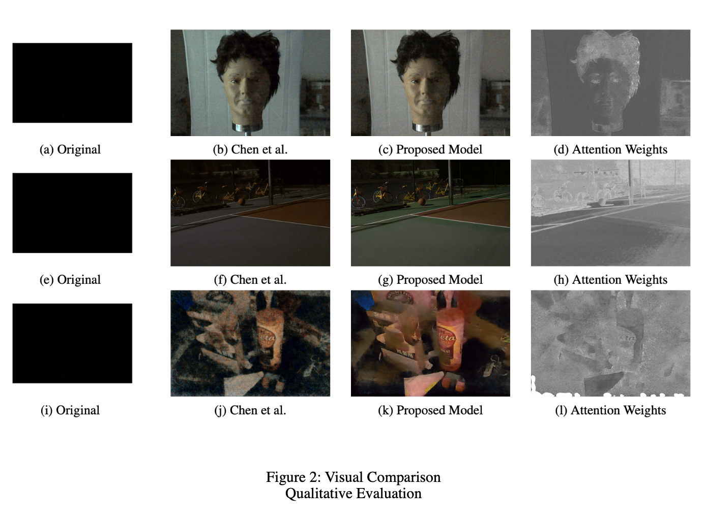

# Learning to See in the Dark
This is my Pytorch implementation of Learning to See in the Dark in CVPR 2018. For more information, please read the Report.pdf and See-In-The-Dark notebook.

[Original paper](http://cchen156.web.engr.illinois.edu/paper/18CVPR_SID.pdf) by [Chen Chen](http://cchen156.web.engr.illinois.edu/), [Qifeng Chen](http://cqf.io/), [Jia Xu](http://pages.cs.wisc.edu/~jiaxu/), and [Vladlen Koltun](http://vladlen.info/).

[Original Tensorflow implementation](https://github.com/cchen156/Learning-to-See-in-the-Dark) by Chen Chen

# Presented by
yt2188@nyu.edu – Yash Thesia
ms12418@nyu.edu – Meera Suthar

# Abstract

This term paper surveys various research papers aimed at forecasting weather. We explore cutting-edge research towards deep learning algorithms and technology. Convolutional networks help preserve information of data points in physical or logical proximity when placed together on a matrix, and help reduce the computation size using the concept of 2-D filters, for example precipitation levels of a location based on levels of neighboring cities or towns. Recurrent networks help preserve information gained with past iterations of training, and are thus much more flexible when trying to analyze time-series data, like today’s precipitation levels based on past precipitation levels. And autoencoders help overcome overfitting by extracting useful features from the given data, which also helps reduce the vanishing gradient problem.

## Results
|                   | PSNR on test set | 
|-------------------|------------------|
| Chen et al.       | 27.60            | 
| My implementation | 28.96            | 

- Results and Comparisons (All the models were trained for only 500 epochs; increasing the number of epochs for training may increase the resultant PSNR and SSIM values)

## Low Light Image Enhancement Proposed Pipeline 

## Training & validation PSNR

## Model visual Output Comparision & attenstion weights of last layer

## Requirements
- 128GB RAM
- Pytorch 1.0
- Numpy + Rawpy
- Matplotlib
- GPU : Nvidia RTX1800

## References 

- [1] https://github.com/huyvnphan/Learning_To_See_In_The_Dark
- [2] https://github.com/LeeJunHyun/Image_Segmentation
- [3] https://github.com/ozan-oktay/Attention-Gated-Networks
- [4] https://github.com/aladdinpersson/Machine-Learning-Collection/tree/master/ML/Pytorch/GANs
- [6] Isola, P., Zhu, J. Y., Zhou, T., & Efros, A. A. (2017). Image-to-image translation with conditional adversarial networks. In Proceedings of the IEEE conference on computer vision and pattern recognition (pp. 1125-1134).
- [7] Chen Chen, Qifeng Chen, Jia Xu, and Vladlen Koltun. Learning to see in the dark. 2018 IEEE/CVF Conference on Computer Vision and Pattern Recognition, pages 3291–3300, 2018. 2, 3, 4
